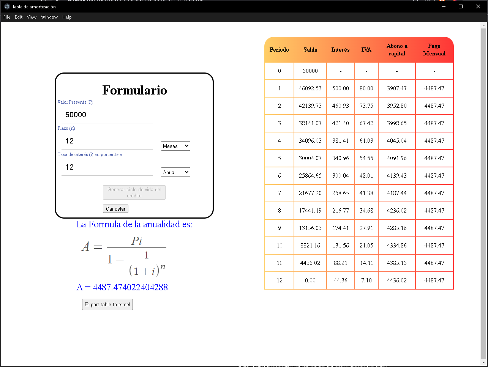

# Amortización Desktop App

Aplicación de escritorio para el cálculo de tablas de amortización, desarrollada con Vue 3 y Electron.

## Descripción

Esta aplicación permite calcular y visualizar tablas de amortización a partir de:

- Valor presente  
- Tasa de interés  
- Plazo en años o meses  

Incluye el cálculo de:

- Intereses  
- IVA  
- Abono a capital  
- Pago mensual  
- Saldo restante  

Además, permite exportar los resultados a Excel.

---

## Tecnologías

- Vue 3  
- Vite  
- Electron  
- JavaScript  

---

## Requisitos

Antes de ejecutar el proyecto necesitas:

- Node.js 20 o superior  
- npm (incluido con Node)  
- Git (opcional, para clonar el repositorio)  

---

## Instalación

Clona el repositorio:
```
git clone https://github.com/Henrriegel/amortizacion.git  
cd amortizacion  
```
Instala dependencias:
```
npm install  
```
---

## Ejecución en desarrollo

Primero inicia el frontend:
```
npm run dev  
```
Luego, en otra terminal, inicia Electron:
```
npm run electron  
```
Esto abrirá la aplicación como app de escritorio.

---

## Ejecutar solo en navegador

También puedes probar la app sin Electron:
```
npm run dev  
```
Y abrir:
```
http://localhost:5173  
```
o el enlace que te muestre la salida

---

## Build de producción

Para generar el instalador de la aplicación:
```
npm run dist  
```
El resultado se generará en la carpeta:
```
release/  
```
---

## Modernización del proyecto

Este proyecto originalmente estaba basado en Vue CLI y fue actualizado a un stack moderno.

Cambios realizados:

- Migración de Vue CLI a Vite  
- Eliminación de dependencias obsoletas  
- Compatibilidad con Node.js moderno  
- Integración manual de Electron (sin plugins legacy)  
- Configuración de build de producción con electron-builder  
- Corrección de rutas para ejecución en entorno empaquetado  

---

## Notas

- El proyecto fue modernizado manteniendo su funcionalidad original  
- La lógica de cálculo se conserva, pero la infraestructura fue actualizada 

## Preview

